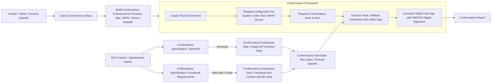
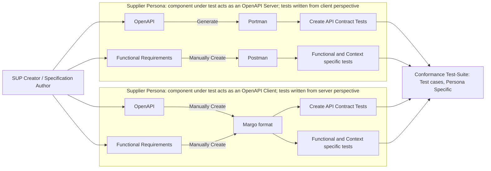

# Margo Conformance Framework

## Objective

The Margo conformance Framework shall be a downloadable Conformance Test Toolkit (CTT) which shall allow Margo adopters to test their Margo conformant component(s) against a specific version of the Margo Specification and generate a Conformance Report. 

The conformance toolkit shall allow the Margo adopter to choose a specific, pre-defined collection of tests, available in the Margo Specifications, for generating the Conformance Report.

This report may be used as evidence of conformance to Margo specifications.

## Key requirements for the Conformance Framework

- The Conformance Tests shall be built as Persona Specific Suites

- The Conformance Tests shall be mapped directly to one or more requirements (having CR-IDs) defined in the Margo specifications, 

- The Conformance Test shall be easy to develop using a well-known / easy to use tool or representation

- It should be possible to select a pre-defined grouping or collection of tests (Test-Suite)

- The Conformance Framework shall be capable of running the tests in an 'on-premise' Linux host

- The Conformance Framework shall record the date/time, version of MARGO specification and the version of the tested component in the test report and sign it with a Digital Signature

- The Conformance Framework shall provide the pass / fail status for each test in the test report along with trace links and evidence references

- The conformance framework may collect the OTEL traces and telemetry as evidence of the test

- The conformance framework may allow upload of test-results to a Margo hosted registry.

## Exclusions from the scope of the Conformance Framework

- The function of the Conformance Framework is to validate ONLY conformance against the Margo specification, hence the Conformance Framework will not validate usability or other aspects of the Margo adopter’s component.

- The Conformance Framework will not be a hosted service provided by Margo.

- The Conformance Framework will not include the Centralized Margo hosted Registry for Supplier Conformance Reports, this will be an independent service.

- The Conformance Framework is not intended to be used in the production deployment environment to classify a workload or device as Margo conformant.

- The Conformance Framework will not validate requirements which cannot be expressed as a series of API exchanges or with checks  (value or regex format) on the content of the API exchange. For example – performance, load e.t.c.

- Platform Supplier Persona is currently in the process of being defined in Margo specification, hence not supported in the initial scope of the Conformance Framework.

## Working with the Conformance Framework 

### High Level Use-Case

- The Conformance Framework shall allow the Margo Development team & Specification authors (SUP Authors and Test-Case Developers) to create Test-Cases from the Margo OpenAPI specification as well as functional requirements from the Margo Conformance Requirements. 

- The Specification Author shall write test-cases in a prescribed format, or generate the test-cases from the OpenAPI specification.

- Test-cases can be grouped into one or more Test-Suites. 

- A Test-Suite can have test-cases corresponding to only a single persona.




*Figure 1 : Top-Level use-case for the Conformance Framework*

### Supplier Personas

- The Margo architecture defines different Suppliers as Personas.

- Conformance test-cases will be persona specific.

- Each persona will have a unique test-configuration consisting of several ‘Elements’.

- The following Supplier Personas are identified by Margo – 

- Application Supplier.

- Workload Fleet Manager (WFM) Supplier.

- Device Supplier.

- Note: Platform Supplier Persona is currently not clearly defined in scope

### Persona Specific Use-Cases

- The Conformance Frameworks will have different components (Elements) as required for the testing of a specific persona.

- The role of a Margo Element may change from persona to persona, for example – For testing conformance for a WFM Supplier, the Device shall act as a simulated Client Element, however for testing conformance for a Device Supplier, the Device shall be real and the WFM will be a simulated Server Element.

<table>
<tr>
<th>
- **Supplier Persona**
</th>
<th>
- **Conformance Framework ****Simulated ****Elements**
</th>
<th>
- **Real Element from Supplier**
</th>
</tr>
<tr>
<td>
- App Supplier
</td>
<td>
- App Container Registry, OCI Component Registry &amp; App Registry<br>- WFM <br>- WFM Client<br>- OTEL Telemetry Collector
</td>
<td>
- Application container images and Margo Manifest
</td>
</tr>
<tr>
<td>
- WFM Supplier
</td>
<td>
- App Container Registry, OCI Component Registry &amp; App Registry<br>- Margo Manifest<br>- WFM Client &amp; OTEL Telemetry 
</td>
<td>
- WFM with OTEL Server and<br>- (Optional) OCI Registry
</td>
</tr>
<tr>
<td>
- Device Supplier
</td>
<td>
- WFM<br>- App Container Registry, OCI Component Registry &amp; App Registry<br>- OTEL Telemetry  Server
</td>
<td>
- Device with Margo WFM Client and OTEL Telemetry Client
</td>
</tr>
</table>

## Framework Design

- The Conformance Framework will be provided as a set of docker images and a Docker-Compose file, the Supplier can also clone the Margo Github repository and build the docker images.

- Note: Further design details will evolve as we progress.

- Key elements of the Conformance Framework are mentioned in [Figure 1]

- These include – 

- **A ****common ****format**** (schema)** for generating or manually writing conformance test-cases.

- **A test-configurator** that brings up the persona specific elements.

- **A test****-runner** or engine that can read test-cases from a collection (test-suite) and execute the test-cases and record the result

- **A test-report format** that provides the results of the tests, the reason for failures

- **A test-report generator** that reads log files and generates the test-report.

- The Framework will need to cater to different configurations of ‘Elements’ for each Persona as mentioned above.

- Additionally, the Supplier can have a “Server” or a “Client” component as defined in the Margo System Design. This needs to be accommodated in the Conformance Framework, which needs to serve as the peer element and allow the Margo Community to create test-cases for each perspective. This is explained in the following sections.

- The Framework shall attempt to re-use existing open-source frameworks like Portman and Newman for generating and running API Contract Tests. These tools are selected from a range of available tools for writing “Client-Side” tests for API contracts with a high degree of automation. There is a table of alternative tools also discussed in the Appendix section.

- The Framework shall provide a format / schema for manually writing “Server-Side” test-cases (where the Margo Supplier is providing the “Client-Side” component, for example the Device) as there is a lack of available tooling for verifying Client API conformance. The format / schema is discussed in the following sections.

## Creating Conformance Test-Cases

### Types of Conformance tests

- API Contract tests – Tests which check for compliance against Margo OpenAPI Specification

- Functional & Context specific tests – Tests which check for compliance against functional aspects of the Margo Specification, which includes sequence of API calls, specific attributes whose values should be re-used in subsequent API exchanges.

### Client and Server Perspectives for tests

- Client Perspective – When the Supplier Persona has a component that acts as a OpenAPI ‘Client’ and the Conformance Framework components act as Servers. These test-cases require the Conformance Framework to validate the incoming API Request from the Supplier component, validate the Request and respond with the pre-defined Response.

- Server Perspective – When the Supplier Persona has a component that acts as a OpenAPI ‘Server’ and the Conformance Framework components act as a Client. These test-cases require the Conformance Framework to send an API Request to the Supplier component, and validate the response.




*Figure 2 : Creating Conformance Test-Cases and adding to Test-Suite*

### API Contract Tests : Test-case generation from Margo OpenAPI Specification

- Conformance test-cases, which directly draw from API contracts defined in the OpenAPI specification, can be generated using open-source tools like Portman

- _For the __WFM__ __Supplier persona_, the Margo conformance test-cases will mostly consist of test-cases written from the ‘Client’ perspective with the WFM as the system under test, as specified from the Margo OpenAPI based specification.

- The Margo Conformance Framework shall allow import of API Contract tests, generated using tools like Portman. The Margo Conformance Framework will execute these tests using a utility like Newman.

- This will allow the addition of specific, tailored, hand-written test-cases written using Postman, to be added the Conformance Suite.

- _For the __Device Supplier persona_, the  Margo conformance test-cases will mostly consist of test-cases written from the ‘Server’ perspective with the Device as the system under test, as specified from the Margo OpenAPI based specification.

- The Margo Conformance Framework will define a format (JSON Schema) to write tailored, hand-written test-cases which can evaluate the conformance of the Device’s WFM Client to the Margo OpenAPI specification.

- Note : It may be possible to generate these test-cases from the Margo specification using LLMs, but this is not part of the initial scope.

- _For the App Supplier persona_, the  Margo conformance test-cases will mostly validate the Margo Application Description against the Margo specification. This shall be done using a JSON Schema based validation, however there may be test-cases which require access to the App Supplier’s artefacts, which can be written as ‘Client’ side test-cases in Postman.

#### Automated Client-Side test-case generation for API Contracts using Portman

Portman requires the OpenAPI YAML file as input and then generates tests as PostMan collections. The mechanism will be enabled by the Conformance Framework scripting & tooling with necessary documentation.

Postman allows a variety of validations and assertions; these are documented in Postman user-guide. 

#### Manual Server-Side test-case writing for API Contract tests

These tests require a specific schema, which will be defined as part of the Conformance Framework, to be followed while writing the test-cases. The schema follows the patter of Client side tests written in Postman, but does not include JavaScript based validation hooks. Instead, there will be specific validation an assertion elements that can be added in the test-case. 

Further details are described below in the section [Margo schema for server-side test-cases].

### Functional & Context specific tests 

- This class of Conformance test-cases require the ability to check functional requirements which check if :

- The APIs are in an intended sequence as defined by the Margo specification

- Or, a matching rule is applied between fields of an API sequence. For example – the encoding of the API Header is as per the rules defined in the Margo API specification

- Or, a matching value is used in a subsequent API call. For example – The Device uses the same client-id as issued during Device Client onboarding

- Or, other cases as defined below.

Note : Further details are described below in the section [Margo schema for server-side test-cases].

- These test-cases need to be manually written using Postman for Client-side test-cases, but the Conformance Framework needs to provide a format / schema to write Server-side test-cases

#### Postman Template for Expressing sequences of API exchanges, Client-Side test-cases

- Postman allows API sequences as well as validations and assertions

- The schema is provided here – [https://schema.postman.com/collection/json/v2.1.0/draft-07/docs/index.html]

#### Margo template for Expressing sequence of API exchanges , Server side test-cases

See the section below [Margo schema for server-side test-cases].

## Margo schema for server-side test-cases

- The test-cases are a collection of one or more scenarios (API exchanges) which consist of a sequence of ‘steps’.

### Scenarios

- Scenarios will be run in order of appearance, top to bottom.

- Each scenarios will have its own set of variables, context will not be preserved between scenarios.

```json
[
  { "id": "lorem", “name: “”, "steps": [ ... ], description: “” },
  { "id": "ipsum", “name: “”, "steps": [ ... ], description: “” },
  { "id": "stratos", “name: “”, "steps": [ ... ], description: “” }
]
```

```json
{
  "id": "scenario-unique-id",
  "name": "Human Readable Name",
  "description": "What this scenario validates",
  "steps": [ ... ]
}
```

<table>
<tr>
<th>
**Field**
</th>
<th>
**Required**
</th>
<th>
**Description**
</th>
</tr>
<tr>
<td>
`id`
</td>
<td>
Yes
</td>
<td>
Unique string among all scenarios. Used for filtering: `./bin/run\_tests -scenario scenario-onboarding`
</td>
</tr>
<tr>
<td>
`name`
</td>
<td>
Yes
</td>
<td>
Displayed in terminal output and HTML report
</td>
</tr>
<tr>
<td>
`description`
</td>
<td>
Yes
</td>
<td>
One-line explanation of what this scenario covers
</td>
</tr>
<tr>
<td>
`steps`
</td>
<td>
Yes
</td>
<td>
Ordered array of step objects (see below)
</td>
</tr>
</table>

*Table 1 : Field descripotion of Scenario object*

- Scenarios consist of ‘steps’, which are again run in sequence of appearance.

### Steps

- A ‘step’ is an API expected from the Margo Supplier component, the test-case ‘step’ defines the expected HTTP Request Header, encryption and validations. If the received API has the right HTTP Request, the HTTP Response defined in the step is sent, otherwise the specified failure response is sent.

- Each step can have the following content - 

```json
{
  "id": "step-1.2",
  "name": "Onboard Trusted Device",
  "method": "POST",
  "endpoint": "/api/v1/onboarding",
  "request_body": 
  {
    "apiVersion": "onboarding.margo.org/v1alpha1",
    "kind": "OnboardingRequest",
    "certificate": "./certs/device-valid-cert.pem",
  }
  "headers": 
  {
    "Accept": "application/vnd.margo.manifest.v1+json"
  },
  "expected_status": 201,
  "validations": 
  [
    { "field": "clientId", "operation": "is_string" }
  ],
  "extract_context": 
  {
    "clientId": "clientId"
  },
  "skip_signing": false,
  "skip_certificate_injection": false
}
```

<table>
<tr>
<th>
**Field**
</th>
<th>
**Required**
</th>
<th>
**Type**
</th>
<th>
**Description**
</th>
</tr>
<tr>
<td>
`id`
</td>
<td>
Yes
</td>
<td>
string
</td>
<td>
Unique step ID. Convention: `step-X.Y` where X is scenario number and Y is step number. Used for filtering: `./bin/run\_tests -step step-1.2`
</td>
</tr>
<tr>
<td>
`name`
</td>
<td>
Yes
</td>
<td>
string
</td>
<td>
Displayed in terminal and HTML report
</td>
</tr>
<tr>
<td>
`method`
</td>
<td>
Yes
</td>
<td>
string
</td>
<td>
HTTP verb: `"GET"`, `"POST"`, or `"PUT"`
</td>
</tr>
<tr>
<td>
`endpoint`
</td>
<td>
Yes
</td>
<td>
string
</td>
<td>
URL path (without base URL). Supports `{placeholder}` substitution
</td>
</tr>
<tr>
<td>
`request\_body`
</td>
<td>
No
</td>
<td>
object
</td>
<td>
JSON body sent with POST/PUT. Omit entirely for GET requests
</td>
</tr>
<tr>
<td>
`headers`
</td>
<td>
No
</td>
<td>
object
</td>
<td>
Custom HTTP headers. Applied after signing. Values support `{placeholder}` substitution
</td>
</tr>
<tr>
<td>
`expected\_status`
</td>
<td>
Yes
</td>
<td>
number
</td>
<td>
HTTP status code the step expects. Anything else → FAIL
</td>
</tr>
<tr>
<td>
`validations`
</td>
<td>
No
</td>
<td>
array
</td>
<td>
Response field checks (see Validations section below)
</td>
</tr>
<tr>
<td>
`extract\_context`
</td>
<td>
No
</td>
<td>
object
</td>
<td>
Save response values as variables for later steps (see Context section below)
</td>
</tr>
<tr>
<td>
`skip\_signing`
</td>
<td>
No
</td>
<td>
bool
</td>
<td>
Default `false`. Set `true` to omit RFC 9421 Signature headers — use for GET requests or negative signature tests
</td>
</tr>
<tr>
<td>
`skip\_certificate\_injection`
</td>
<td>
No
</td>
<td>
bool
</td>
<td>
Default `false`. Set `true` to send `certificate` field as a literal string without loading from file — use for rejection/blocklist tests
</td>
</tr>
</table>

*Table 2 : Fields in the Step object*

### Enablement for Functional & Context specific tests 

This class of tests requires validation of a sequence of incoming API requests from a Margo Supplier’s component. It also includes tests on values of fields as well as consistency checks in the form of context-variables for checking across steps.

#### Validations

- The ‘validations’ field in the ‘step’ object is an array of all validations to be applied on the received HTTP request. An example of validations that can be specified is given below.

```json
"validations":
 [
  { "field": "clientId",    "operation": "is_string" },
  { "field": "status",      "operation": "equals",    "value": "capabilities_received" },
  { "field": "error",       "operation": "contains",  "value": "Client rejected" },
  { "field": "certificate", "operation": "not_empty" },
  { "field": "deployments", "operation": "is_array"  },
  { "field": "_headers.ETag", "operation": "not_empty" }
]
```

- The following ‘operations’ can be specified as a validation – 

<table>
<tr>
<th>
**Operation**
</th>
<th>
**`value` needed?**
</th>
<th>
**Passes when**
</th>
</tr>
<tr>
<td>
`equals`
</td>
<td>
Yes
</td>
<td>
Field value matches `value` exactly
</td>
</tr>
<tr>
<td>
`contains`
</td>
<td>
Yes
</td>
<td>
Field value (string) contains `value` as substring
</td>
</tr>
<tr>
<td>
`not\_empty`
</td>
<td>
No
</td>
<td>
Field is present and not `""`, `null`, or `\[]`
</td>
</tr>
<tr>
<td>
`exists`
</td>
<td>
No
</td>
<td>
Field is present (any value including empty)
</td>
</tr>
<tr>
<td>
`is\_string`
</td>
<td>
No
</td>
<td>
Field value is a JSON string
</td>
</tr>
<tr>
<td>
`is\_number`
</td>
<td>
No
</td>
<td>
Field value is a JSON number
</td>
</tr>
<tr>
<td>
`is\_array`
</td>
<td>
No
</td>
<td>
Field value is a JSON array
</td>
</tr>
</table>

#### Context or State Variables

- The Conformance Framework will extract and maintain the following ‘state variables’ between ‘steps’ in a ‘scenario’.

- This allows the test-case to apply consistency checks as part of Context specific tests.

<table>
<tr>
<th>
**Path**
</th>
<th>
**Accesses**
</th>
</tr>
<tr>
<td>
`"clientId"`
</td>
<td>
Top-level field
</td>
</tr>
<tr>
<td>
`"status.state"`
</td>
<td>
Nested field
</td>
</tr>
<tr>
<td>
`"deployments.0.id"`
</td>
<td>
First array element's `id`
</td>
</tr>
<tr>
<td>
`"\_headers.ETag"`
</td>
<td>
HTTP response header (prefix with `\_headers.`)
</td>
</tr>
</table>

- Example of using this :

- `extract\_context` saves values from a response. 

- `{placeholders}` injects the extracted value into a later step.

- Saving a value:

```json
"extract\_context": {
  "clientId":      "clientId",
  "manifestEtag":  "\_headers.ETag"
}
```

- On the left side is the variable name. On the right side is the JSON path (same syntax used in the validations).

- Using a saved value:

```json
"endpoint": "/api/v1/clients/{clientId}/capabilities",

"headers": {
  "If-None-Match": "{manifestEtag}"
},

"request\_body": {
  "deploymentId": "{deploymentId}"
}

```

### Enablement for API Contract tests

- API Contracts are defined as part of the Margo OpenAPI specification’s swagger YAML.

- Being static in nature, these set of tests are tied to a specific version of the Margo specification.

- They will be represented in a single file, with the following generic structure :

```json
{
  "rejected_certificates": [ ... ],
  "endpoints": 
  {
    "POST_onboarding":    { ... },
    "POST_capabilities":  { ... },
    "PUT_capabilities":   { ... },
    "POST_status":        { ... },
    "GET_onboarding_certificate": { ... }
  },
  "error_responses": 
  {
    "badRequest":    { "status_code": 400, "format": "error_string" },
    "unprocessable": { "status_code": 422, "format": "validation_errors" }
  }
}
```

<table>
<tr>
<th>
**Key**
</th>
<th>
**Purpose**
</th>
</tr>
<tr>
<td>
`rejected\_certificates`
</td>
<td>
Array of cert values that get a 403 response during onboarding
</td>
</tr>
<tr>
<td>
`endpoints`
</td>
<td>
Map of `METHOD\_name` → validation rules for that endpoint
</td>
</tr>
<tr>
<td>
`error\_responses`
</td>
<td>
Defines what error format each type of failure uses
</td>
</tr>
</table>

*Table 3: Fields in the API Contract test*

- An element of  ‘endponts’ has the following structure – 

```json
"POST_onboarding": 
{
  "path": "/api/v1/onboarding",
  "method": "POST",
  "status_code": 201,
  "validation_error_key": "badRequest",
  "validations": [ ... ],
  "response_structure": 
  {
    "matches": 
    [
      { "description": "Response must contain clientId", "json": "clientId", "type": "string" }
    ]
  }
}
```

- Field descriptions of the ‘endpoints’ object are given below :

<table>
<tr>
<th>
**Field**
</th>
<th>
**Required**
</th>
<th>
**Meaning**
</th>
</tr>
<tr>
<td>
`path`
</td>
<td>
Yes
</td>
<td>
URL path (informational, not used for routing)
</td>
</tr>
<tr>
<td>
`method`
</td>
<td>
Yes
</td>
<td>
HTTP method (informational)
</td>
</tr>
<tr>
<td>
`status\_code`
</td>
<td>
Yes
</td>
<td>
Expected HTTP status on success
</td>
</tr>
<tr>
<td>
`validation\_error\_key`
</td>
<td>
Only for write endpoints
</td>
<td>
Which `error\_responses` entry to use when validation fails (`"badRequest"` or `"unprocessable"`)
</td>
</tr>
<tr>
<td>
`validations`
</td>
<td>
Yes
</td>
<td>
Array of rule objects (see below)
</td>
</tr>
<tr>
<td>
`response\_structure`
</td>
<td>
No
</td>
<td>
Documents expected response fields (informational)
</td>
</tr>
</table>

*Table 4 : Fields in the 'endpints' object of a API Contract*

#### Validations

- ‘Validations’ are rules used to evaluate the API contract as specified in the OpenAPI specification

```json
{
  "rule_id": "capabilities-008",
  "field": "properties.roles",
  "type": "array",
  "required": true,
  "itemsType": "string",
  "itemsEnum": ["Standalone Cluster", "Cluster Leader", "Standalone Device"],
  "description": "properties.roles must contain valid Margo device roles"
}
```

<table>
<tr>
<th>
**Field**
</th>
<th>
**Type**
</th>
<th>
**Required**
</th>
<th>
**Description**
</th>
</tr>
<tr>
<td>
`rule\_id`
</td>
<td>
string
</td>
<td>
Yes
</td>
<td>
Unique identifier. Naming convention: `endpoint-NNN` e.g., `"capabilities-011"`
</td>
</tr>
<tr>
<td>
`field`
</td>
<td>
string
</td>
<td>
Yes
</td>
<td>
JSON path to the field being validated (see Path Syntax below)
</td>
</tr>
<tr>
<td>
`type`
</td>
<td>
string
</td>
<td>
Yes
</td>
<td>
One of: `"string"`, `"number"`, `"object"`, `"array"`
</td>
</tr>
<tr>
<td>
`required`
</td>
<td>
bool
</td>
<td>
Yes
</td>
<td>
If `true`, server rejects request if field is absent
</td>
</tr>
<tr>
<td>
`value`
</td>
<td>
string/any
</td>
<td>
No
</td>
<td>
If set, field must match exactly this value
</td>
</tr>
<tr>
<td>
`enum`
</td>
<td>
string[]
</td>
<td>
No
</td>
<td>
If set, field value must be one of these strings
</td>
</tr>
<tr>
<td>
`minLength`
</td>
<td>
number
</td>
<td>
No
</td>
<td>
For `"string"` type: minimum character count
</td>
</tr>
<tr>
<td>
`minItems`
</td>
<td>
number
</td>
<td>
No
</td>
<td>
For `"array"` type: minimum number of items
</td>
</tr>
<tr>
<td>
`itemsType`
</td>
<td>
string
</td>
<td>
No
</td>
<td>
For `"array"` type: each item must be this type (`"string"` or `"object"`)
</td>
</tr>
<tr>
<td>
`itemsEnum`
</td>
<td>
string[]
</td>
<td>
No
</td>
<td>
For `"array"` type: each item must be one of these values
</td>
</tr>
<tr>
<td>
`description`
</td>
<td>
string
</td>
<td>
Yes
</td>
<td>
Human-readable explanation used in error messages
</td>
</tr>
</table>

- Pre-built validations are supported for the following types :

<table>
<tr>
<th>
**`type`**
</th>
<th>
**What the engine checks**
</th>
</tr>
<tr>
<td>
`"string"`
</td>
<td>
Value is a string; optionally checks `value` (exact match), `enum`, `minLength`
</td>
</tr>
<tr>
<td>
`"number"`
</td>
<td>
Value is a JSON number (float64 internally)
</td>
</tr>
<tr>
<td>
`"object"`
</td>
<td>
Value is a JSON object `{}`
</td>
</tr>
<tr>
<td>
`"array"`
</td>
<td>
Value is a JSON array `\[]`; optionally checks `minItems`, `itemsType`, `itemsEnum`
</td>
</tr>
</table>

### Providing Certificates for verifying the Client Envelope in the HTTP Header

- The `certificate` field inside `request\_body` of the ‘step’ gets special treatment.

- **Load from file (positive tests):**

```json
"request\_body": {
  "certificate": "./certs/device-valid-cert.pem"
}
```

- The Conformance Framework detects the path prefix and reads the file. Actual PEM content is sent to the server.

- **Use literal string (rejection/negative tests):**

```json
"request\_body": {
  "certificate": "rnd-key-7f3a91b2c4d8e6"
},
"skip\_certificate\_injection": true
```

- Conformance Framework skips file loading. Literal string `"rnd-key-7f3a91b2c4d8e6"` is sent — server's rejection list blocks it with 403.

## APPENDIX

### Example test-case

```json
[
  { "id": "scenario-onboarding", ... },
  { "id": "scenario-capabilities", ... },
  {
    "id": "X",
    "name": "My New Test",
    "description": "Tests X behavior",
    "steps": 
    [
      { ...step X.1... },
      { ...step X.2... }
    ]
  }
]
```

### Examples of ‘Steps’ in the Test-Cases

- Example ‘Step’ in a test-case: Verify server accepts a valid onboarding request.

```json
{
  "id": "step-X.1",
  "name": "Onboard with valid certificate",
  "method": "POST",
  "endpoint": "/api/v1/onboarding",
  "request_body": 
  {
    "apiVersion": "onboarding.margo.org/v1alpha1",
    "kind": "OnboardingRequest",
    "certificate": "./certs/device-valid-cert.pem"
  },
  "expected_status": 201,
  "validations": 
  [
    { "field": "clientId", "operation": "is_string" }
  ],
  "extract_context": 
  {
    "clientId": "clientId"
  }
}
```

- Example ‘Step’ in a test-case: Error / Rejection (expect failure)

```json
{
  "id": "step-X.2",
  "name": "Reject onboarding with missing kind",
  "method": "POST",
  "endpoint": "/api/v1/onboarding",
  "request_body": 
  {
    "apiVersion": "onboarding.margo.org/v1alpha1",
    "certificate": "./certs/device-valid-cert.pem"
  },
  "expected_status": 400,
  "validations": 
  [
    { "field": "error", "operation": "contains", "value": "kind" }
  ],
  "extract_context": {}
}
```

- Example ‘Step’ in a test-case: Multi-Step Flow (chain steps with context)

```json
{
  "id": "step-X.1",
  "name": "Onboard Device",
  "method": "POST",
  "endpoint": "/api/v1/onboarding",
  "request_body": 
  {
    "apiVersion": "onboarding.margo.org/v1alpha1",
    "kind": "OnboardingRequest",
    "certificate": "./certs/device-valid-cert.pem"
  },
  "expected_status": 201,
  "validations": 
  [
    { "field": "clientId", "operation": "exists" }
  ],
  "extract_context": 
  {
    "clientId": "clientId"
  }
}
{
  "id": "step-X.2",
  "name": "Report Capabilities",
  "method": "POST",
  "endpoint": "/api/v1/clients/{clientId}/capabilities",
  "request_body": 
  {
    "apiVersion": "device.margo.org/v1alpha1",
    "kind": "DeviceCapabilitiesManifest",
    "properties": 
    {
      "id": "my-device-001",
      "vendor": "MyVendor",
      "modelNumber": "MDL-100",
      "serialNumber": "SN-99999",
      "roles": ["Standalone Device"],
      "resources": 
      {
        "cpu": { "cores": 4, "architecture": "arm64" },
        "memory": "8Gi",
        "storage": "64Gi",
        "interfaces": [{ "type": "ethernet" }],
        "peripherals": []
      }
   }
  },
  "expected_status": 201,
  "validations": [
  { "field": "status", 
    "operation": "equals", 
    "value": "capabilities_received" 
  }
],
  "extract_context": {}
}
```

### Examples of Assertions used in API Contract test

**Pattern 1: Required exact-value string**  
_(e.g., __apiVersion__ — spec mandates a fixed value)_

```json
{
  "rule\_id": "onboarding-001",
  "field": "apiVersion",
  "type": "string",
  "required": true,
  "value": "onboarding.margo.org/v1alpha1",
  "description": "apiVersion must be exactly 'onboarding.margo.org/v1alpha1'"
}

```

**Pattern 2: Required non-empty string**  
_(e.g., certificate, __serialNumber__ — must be present, no fixed value)_

```json

{
  "rule\_id": "capabilities-007",
  "field": "properties.serialNumber",
  "type": "string",
  "required": true,
  "minLength": 1,
  "description": "properties.serialNumber is required"
}

```

**Pattern 3: Optional string from allowed set (****enum****)**  
_(e.g., CPU architecture — optional but must be a known value if present)_

```json

{
  "rule\_id": "capabilities-012",
  "field": "properties.resources.cpu.architecture",
  "type": "string",
  "required": false,
  "enum": \["amd64", "x86\_64", "arm64", "arm"],
  "description": "cpu.architecture must use a supported value when present"
}

```

**Pattern 4: Required ****enum**** string**  
_(e.g., deployment state — required, only allowed values)_

```json
{
  "rule\_id": "status-005",
  "field": "status.state",
  "type": "string",
  "required": true,
  "enum": \["pending", "installing", "installed", "failed", "removing", "removed"],
  "description": "status.state must be a valid deployment state"
}
```

**Pattern 5: Required array with ****enum**** items**  
_(e.g., device roles — array, each item must be a known role)_

```json
{
  "rule\_id": "capabilities-008",
  "field": "properties.roles",
  "type": "array",
  "required": true,
  "itemsType": "string",
  "itemsEnum": \["Standalone Cluster", "Cluster Leader", "Standalone Device"],
  "description": "properties.roles must contain valid Margo device roles"
}
```

**Pattern 6: Wildcard array item validation**  
_(e.g., every interface must have a recognized type)_

```json
{
  "rule\_id": "capabilities-016",
  "field": "properties.resources.interfaces.\*.type",
  "type": "string",
  "required": true,
  "enum": \["ethernet", "wifi", "cellular", "bluetooth", "usb", "canbus", "rs232"],
  "description": "Each interface must declare a supported type"
}
```

### Comparison of tools for generating Server-Side test-cases

<table>
<tr>
<th>
**Approach**
</th>
<th>
**What it does**
</th>
<th>
**Why not used**
</th>
</tr>
<tr>
<td>
**Schemathesis**** / ****har**** / Bruno**
</td>
<td>

</td>
<td>

</td>
</tr>
<tr>
<td>
**Postman / Newman**
</td>
<td>
GUI-based HTTP test collections; newman runs tests
</td>
<td>
Does not support use as a OpenAPI Server<br>Requires Postman install, complex export/import
</td>
</tr>
<tr>
<td>
**Pytest**** + requests**
</td>
<td>
Python test code
</td>
<td>
Requires Python, coding knowledge
</td>
</tr>
<tr>
<td>
**Cucumber / Gherkin**
</td>
<td>
BDD test language
</td>
<td>
Requires framework install, feature files
</td>
</tr>
<tr>
<td>
**test-****scenarios.json**** (this suite)**
</td>
<td>
Pure JSON, interpreted by Go runner, but needs test-cases in a prescribed format
</td>
<td>
No tools needed; edit file and re-run
</td>
</tr>
</table>
